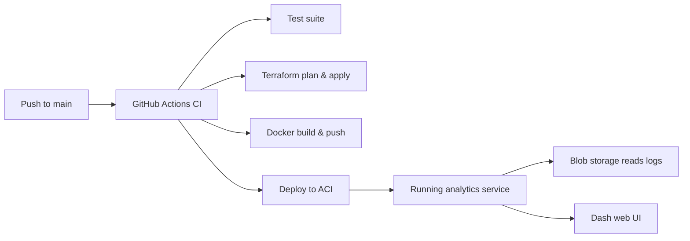

## Overview
This challenge requires implementing a full-stack analytics solution for Azure NSG flow logs: Python ingestion and processing, Plotly Dash visualizations, containerized deployment, and Terraform-based infrastructure automation with CI/CD.

## Application Purpose
This application should:
- Read and decompress zipped CSV NSG flow-log files from an Azure Blob Storage container.
- Parse each record to extract: subscription, resource group, NSG name, source/destination IPs and ports, protocol, flow decision, state, packet and byte counts, and timestamp.
- Aggregate data to identify top talkers (sources) and top listeners (destinations) and summarize common service port usage.
- Detect and highlight denied flows and anomalies (e.g., traffic spikes, persistent connections, unusual patterns).
- Provide interactive Plotly Dash visualizations: bar charts, line charts, heatmaps, geo maps, Sankey diagrams, tables, and summary metrics.
- Enable drill-down filtering by subscription, resource group, NSG, protocol, and time window.
- Provide a CLI entrypoint (`networkflow dashboard`) for local execution.
- Support containerized deployment exposing the dashboard on port 8050.

## Prerequisites
- Docker, Terraform, and Azure CLI installed and authenticated (`az login`).
- GitHub account to push to a private repository.
- **Data Upload**: After Terraform provisions the Storage Account and container, upload your zipped logs (provided in this email)

## Summary of Deliverables & Success Criteria
This section outlines the key components you must implement and the criteria for validating your solution:

Create a `sap-networkflow-challenge` repository on Github to deliver:

1. **Interactive Dash Application**
   - CLI command:
     ```bash
     networkflow dashboard \
       --storage-account <storage_account> \
       --container <container_name>
     ```
   - Serves the Dash UI at `http://localhost:8050` with analytics based on NSG flow-log data.

2. **Dockerized Deployment**
   - Docker command:
     ```bash
     docker run --rm -p 8050:8050 \
       -e AZURE_STORAGE_ACCOUNT=<storage_account> \
       -e AZURE_STORAGE_SAS_TOKEN=<sas_token> \
       <acr_login_server>/networkflow:latest \
       networkflow dashboard \
         --storage-account $AZURE_STORAGE_ACCOUNT \
         --container <container_name> \
         --sas-token $AZURE_STORAGE_SAS_TOKEN
     ```
   - Container runs identically locally and in Azure Container Instance using a SAS token for authentication.

3. **Infrastructure Automation (Terraform)**
   - Provision Azure Storage Account + Blob Container for logs.
   - Provision Azure Container Registry (ACR) and Azure Container Instance (ACI).
   - Use remote backend with locking, modules, and output:
     - `storage_account_name`
     - `container_name`
     - `acr_login_server`
     - `aci_fqdn`

4. **CI/CD Pipeline (GitHub Actions)**
   - Trigger on push to `main`:
     1. Run `pytest` (≥ 80% coverage).
     2. Lint (`flake8` or `pylint`) with no errors.
     3. `terraform plan` & `terraform apply --auto-approve`.
     4. Build & push Docker image (< 200 MB) to ACR.
     5. Deploy/update ACI.

5. **Verification Script**
   - Provide `verify_resources.py`:
     ```bash
     verify_resources.py \
       --storage <storage_account> \
       --container <container_name> \
       --aci <aci_name>
     ```
   - Checks resource existence via Azure SDK, prints service URLs, and returns exit code 0.

## Deliverables

1. **Python Package**  
   - Create a `networkflow` module with:  
     - `parsers.py`: functions to read and decompress zipped CSV logs  
     - `analyzer.py`: processing logic (top talkers, denied flows, anomalies)  
   - Provide a CLI entry point (`dashboard.py`):  
     ```bash
     networkflow dashboard \
       --storage-account <storage_account> \
       --container <container_name>
     ```
   - Write ≥ 3 pytest unit tests covering edge cases, retry/backoff, and zipped input.

2. **Interactive Dashboard (Plotly Dash App)**  
   - Implement `dashboard.py` as a Dash server:  
     - Reads logs from Azure blob storage  
     - Displays:  
       - Bar chart for top 10 source IPs
       - Bar chart for top 10 destination IPs
       - Pie chart for top 10 denied flows
       - Time-series line chart of flows per hour
       - Heatmap for hourly traffic volume
       - Gauge or bullet chart for total flows and % denied
       - Table of top talkers and top listeners
       - Map visualization of geo-located source IPs
       - Sankey diagram of conversation flows between IP pairs
       - Text summary metrics (total flows, % denied, anomaly timestamps)
       - Use best judgement to include additional visualizations highlighting key insights
   - Write ≥ 1 pytest test verifying server startup and endpoints.

3. **Containerization & Deployment**  
   - Add a `Dockerfile` that:  
     - Installs Python dependencies  
     - Copies your package and tests  
     - Defines the `dashboard` entrypoint  
   - Ensure image can be pulled from ACR and run in ACI.

4. **Infrastructure Provisioning (`infra/` Terraform Module)**  
   - Provision:  
     - Azure Storage Account + blob container  
     - Azure Container Registry (ACR)  
     - Azure Container Instance (ACI) pointing to your Docker image  
   - Configure remote backend with locking (Azure Storage).

5. **CI/CD Workflow**  
   - Create `.github/workflows/ci.yml`:  
     - On push to `main`, executes steps under **End Goal & Success Criteria**.  
     - Sets up Azure credentials securely via GitHub Secrets or a vault of your choosing.

6. **Documentation & Verification**  
   - Create `README.md` detailing setup (`az login`, Terraform init/apply, Docker run, dashboard usage).  
   - Provide architecture diagram (Mermaid).  
   - Implement `verify_resources.py` to check resource existence via Azure SDK.

## Architecture Diagram


## Evaluation Criteria
- Code quality & modularity (PEP 8, docstrings, test coverage)  
- Plotly Dash functionality & user experience  
- Terraform best practices (modules, remote state, outputs)  
- CI/CD robustness & speed  
- Clarity and completeness of documentation