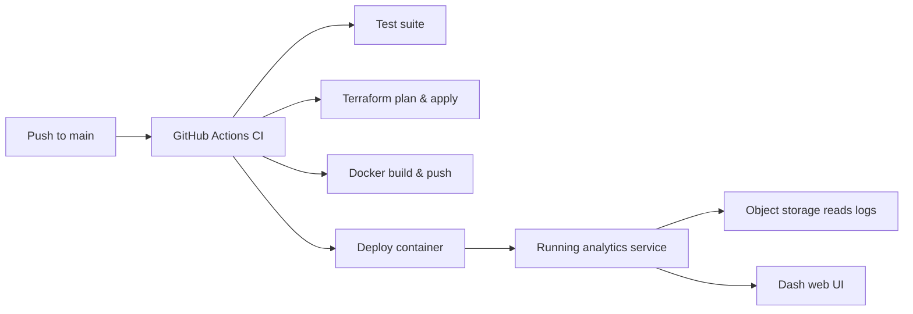

## Objective
Build a full-stack analytics solution that ingests network security flow logs, derives actionable insights, and exposes them through an interactive Plotly Dash experience. The solution should be production-ready, automated, and verifiable end to end.

## Choose Your Cloud
- You may complete the challenge in Azure, AWS, GCP, or another provider. The Azure journey described below acts as the reference baseline.
- Whatever platform you choose, deliver the same capabilities: managed object storage for the logs, container image hosting, container execution, infrastructure automation, secured credentials, and verification tooling.
- Document platform-specific differences clearly so reviewers can deploy and evaluate the solution without guesswork.

## Functional Requirements
Your application must:
- Read and decompress zipped CSV NSG (or equivalent) flow-log files from object storage.
- Parse each record to extract subscription/project, resource group, security group name, source/destination IPs and ports, protocol, flow decision, state, packet and byte counts, and timestamp.
- Aggregate data to highlight top talkers and listeners, summarize common service port usage, and detect denied flows and anomalies (traffic spikes, persistent connections, unusual patterns).
- Provide interactive Plotly Dash visualizations: bar charts, line charts, heatmaps, geo maps, Sankey diagrams, tables, and summary metrics.
- Support drill-down filtering by key dimensions such as subscription, resource group, security group, protocol, and time window.
- Expose a CLI entry point (`networkflow dashboard`) for local execution and a containerized service listening on port 8050.

## Prerequisites
- Terraform, Docker, and the CLI/SDK for your chosen cloud installed and authenticated.
- GitHub account with a private repository to host your submission.
- Zipped flow-log samples (provided separately) uploaded to your provisioned storage account/bucket after infrastructure creation.

## Technical Deliverables
### 1. Python Analytics Package
- Implement a `networkflow` module with at least:
  - `parsers.py` for reading and decompressing zipped CSV logs.
  - `analyzer.py` for computing aggregations, anomaly detection, and summary statistics.
- Provide a CLI entry point (`dashboard.py`) that supports:
  ```bash
  networkflow dashboard \
    --storage-account <storage_account_or_bucket> \
    --container <container_or_prefix>
  ```
- Supply ≥ 3 pytest unit tests covering edge cases (zipped input, retries/backoff, anomaly detection, etc.).

### 2. Plotly Dash Application
- Serve the Dash UI at `http://localhost:8050` (and the same port in containers).
- Include, at minimum:
  - Bar charts for the top 10 source and destination IPs.
  - Visualization of denied flows (pie or bar).
  - Time-series chart of flows per hour and a heatmap for hourly traffic volumes.
  - Gauge/bullet chart summarizing total flows and percentage denied.
  - Table of top talkers/listeners.
  - Map visualization of geo-located source IPs.
  - Sankey diagram showing flow between IP pairs.
  - Text metrics (totals, denial rate, anomaly timestamps).
- Write ≥ 1 pytest test asserting the server boots and key endpoints respond.

### 3. Containerization
- Provide a `Dockerfile` that installs dependencies, copies the package/tests, and sets the dashboard entry point.
- Ensure the image starts identically locally and in your managed container service (Azure Container Instance, AWS ECS/Fargate, GCP Cloud Run/GKE, etc.).
- Document how to run the image locally (e.g., `docker run -p 8050:8050 ...`) and how environment variables/secrets are injected.

### 4. Infrastructure as Code
- Place Terraform code under `infra/` (or equivalent) and provision:
  - Object storage for logs.
  - Container registry.
  - Managed container runtime pointing to the deployed image.
- Configure a remote backend with state locking, use modules where appropriate, and output identifiers/URLs needed by operators (e.g., storage account name, container/bucket, registry endpoint, service FQDN).
- Azure reference: Storage Account + Blob Container, Azure Container Registry, Azure Container Instance. Provide the equivalent if you choose AWS, GCP, or another platform.

### 5. CI/CD Automation
- Add `.github/workflows/ci.yml` triggered on pushes to `main` that:
  1. Runs `pytest` with ≥ 80% coverage.
  2. Runs a linter (`flake8` or `pylint`) without errors.
  3. Executes `terraform plan` and `terraform apply --auto-approve` (or equivalent commands for your chosen cloud).
  4. Builds and pushes the Docker image (< 200 MB) to the container registry.
  5. Deploys or updates the managed container service.
- Use GitHub Secrets (or another secure store) for credentials.

### 6. Verification Tooling
- Implement `verify_resources.py` that is callable as:
  ```bash
  verify_resources.py \
    --storage <storage_account_or_bucket> \
    --container <container_or_prefix> \
    --service <deployed_service_name>
  ```
- Use the appropriate SDK (Azure, AWS, GCP, etc.) to confirm resources exist, print service URLs, and return a non-zero exit code if validation fails.

## Submission Checklist
- [ ] Repository named clearly (e.g., `sap-networkflow-challenge`) with code, infrastructure, and documentation.
- [ ] Updated `README.md` describing setup, deployment, and dashboard usage for the chosen cloud.
- [ ] Terraform (or equivalent IaC) configured with remote state and locking.
- [ ] CI/CD pipeline passing and visible in the repository.
- [ ] Docker image build instructions plus container registry details.
- [ ] `verify_resources.py` output confirming deployed resources.
- [ ] Any assumptions, trade-offs, or future enhancements captured in documentation.

## Reference Architecture


## Evaluation Criteria
- Code quality & modularity (PEP 8, docstrings, test coverage).
- Plotly Dash functionality & user experience.
- Terraform (or chosen IaC) hygiene: modules, remote state, outputs.
- CI/CD robustness, speed, and clarity.
- Documentation completeness, including cloud-specific nuances and reproduction steps.
