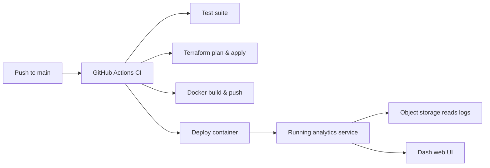

## Objective
Build a full-stack analytics solution that ingests network security flow logs, derives actionable insights, and exposes them through an interactive Plotly Dash experience. The solution should be production-ready, automated, and verifiable end to end.

## Choose Your Cloud
- You may complete the challenge in Azure, AWS, GCP, or another provider. The Azure journey described below acts as the reference baseline.
- Whatever platform you choose, deliver the same capabilities: managed object storage for the logs, container image hosting, container execution, infrastructure automation, secured credentials, and verification tooling.
- Document platform-specific differences clearly so reviewers can deploy and evaluate the solution without guesswork.

## Functional Requirements
Your application must:
- Read and decompress zipped CSV NSG (or equivalent) flow-log files from object storage.
- Parse each record to extract subscription/project, resource group, security group name, source/destination IPs and ports, protocol, flow decision, state, packet and byte counts, and timestamp.
- Aggregate data to highlight top talkers and listeners, summarize common service port usage, and detect denied flows and anomalies (traffic spikes, persistent connections, unusual patterns).
- Provide interactive Plotly Dash visualizations: bar charts, line charts, heatmaps, geo maps, Sankey diagrams, tables, and summary metrics.
- Support drill-down filtering by key dimensions such as subscription, resource group, security group, protocol, and time window.
- Expose a CLI entry point (`networkflow dashboard`) for local execution and a containerized service listening on port 8050.

## Prerequisites
- Terraform, Docker, and the CLI/SDK for your chosen cloud installed and authenticated.
- GitHub account that can accept a collaborator invitation to this repository and push branches here.
- Ability to produce or simulate zipped flow-log samples that follow the schema described below (no raw datasets are stored in this repository).

## Technical Deliverables
### 1. Python Analytics Package
- Implement a `networkflow` module with at least:
  - `parsers.py` for reading and decompressing zipped CSV logs.
  - `analyzer.py` for computing aggregations, anomaly detection, and summary statistics.
- Provide a CLI entry point (`dashboard.py`) that supports:
  ```bash
  networkflow dashboard \
    --storage-account <storage_account_or_bucket> \
    --container <container_or_prefix>
  ```
- Supply ≥ 3 pytest unit tests covering edge cases (zipped input, retries/backoff, anomaly detection, etc.).

### 2. Plotly Dash Application
- Serve the Dash UI at `http://localhost:8050` (and the same port in containers).
- Include, at minimum:
  - Bar charts for the top 10 source and destination IPs.
  - Visualization of denied flows (pie or bar).
  - Time-series chart of flows per hour and a heatmap for hourly traffic volumes.
  - Gauge/bullet chart summarizing total flows and percentage denied.
  - Table of top talkers/listeners.
  - Map visualization of geo-located source IPs.
  - Sankey diagram showing flow between IP pairs.
  - Text metrics (totals, denial rate, anomaly timestamps).
- Write ≥ 1 pytest test asserting the server boots and key endpoints respond.

### 3. Containerization
- Provide a `Dockerfile` that installs dependencies, copies the package/tests, and sets the dashboard entry point.
- Ensure the image starts identically locally and in your managed container service (Azure Container Instance, AWS ECS/Fargate, GCP Cloud Run/GKE, etc.).
- Document how to run the image locally (e.g., `docker run -p 8050:8050 ...`) and how environment variables/secrets are injected.

### 4. Infrastructure as Code
- Place Terraform code under `infra/` (or equivalent) and provision:
  - Object storage for logs.
  - Container registry.
  - Managed container runtime pointing to the deployed image.
- Configure a remote backend with state locking, use modules where appropriate, and output identifiers/URLs needed by operators (e.g., storage account name, container/bucket, registry endpoint, service FQDN).
- Azure reference: Storage Account + Blob Container, Azure Container Registry, Azure Container Instance. Provide the equivalent if you choose AWS, GCP, or another platform.

### 5. CI/CD Automation
- Add `.github/workflows/ci.yml` triggered on pushes to `main` that:
  1. Runs `pytest` with ≥ 80% coverage.
  2. Runs a linter (`flake8` or `pylint`) without errors.
  3. Executes `terraform plan` and `terraform apply --auto-approve` (or equivalent commands for your chosen cloud).
  4. Builds and pushes the Docker image (< 200 MB) to the container registry.
  5. Deploys or updates the managed container service.
- Use GitHub Secrets (or another secure store) for credentials.

### 6. Verification Tooling
- Implement `verify_resources.py` that is callable as:
  ```bash
  verify_resources.py \
    --storage <storage_account_or_bucket> \
    --container <container_or_prefix> \
    --service <deployed_service_name>
  ```
- Use the appropriate SDK (Azure, AWS, GCP, etc.) to confirm resources exist, print service URLs, and return a non-zero exit code if validation fails.

## Data Requirements & Synthesis
- We do not ship proprietary flow logs in this repository. Each candidate must supply representative data so the dashboard and analytics can be evaluated.
- Provide a zipped CSV (or a set of CSV files zipped by hour/day) that matches the schema below. You may request anonymized samples from your recruiting contact or generate synthetic data yourself.
- If you generate data programmatically, include the script/notebook under `tools/` (or similar) and document how to regenerate the dataset.
- Dataset expectations:
  - ≥ 24 hours of traffic covering multiple subscriptions/projects and resource groups.
  - Both allowed and denied flows with varied protocols (TCP, UDP, ICMP) and port ranges.
  - At least one anomaly pattern (e.g., spike in denied flows, long-lived connection, lateral movement scenario).
  - Geo-diverse IPs so the map visualization demonstrates value (use public IP-to-country mappings or mock data).
- Recommended schema:

| Column | Description |
| --- | --- |
| `timestamp` | ISO 8601 timestamp (UTC) for the flow event. |
| `subscription_id` | Cloud subscription/account identifier. |
| `resource_group` | Resource group/project/workload identifier. |
| `nsg_name` | Network security group (or equivalent) name. |
| `src_ip` | Source IPv4/IPv6 address. |
| `src_port` | Source port (integer). |
| `dst_ip` | Destination IPv4/IPv6 address. |
| `dst_port` | Destination port (integer). |
| `protocol` | Protocol string (TCP/UDP/ICMP/etc.). |
| `flow_direction` | Inbound/Outbound. |
| `flow_decision` | Allow/Deny (or similar disposition). |
| `flow_state` | State metadata (Established, Start, Teardown, etc.). |
| `packets` | Packet count (integer). |
| `bytes` | Byte count (integer). |
| `region` | Cloud region or location for the resource. |
| `geo_src` *(optional)* | Country/region derived from `src_ip`. |
| `geo_dst` *(optional)* | Country/region derived from `dst_ip`. |

- Feel free to extend the schema with additional metadata if it improves your analytics (tags, application, threat category, etc.). Document any deviations so reviewers can parse the data quickly.

## Cloud Implementation Guides
The challenge is cloud-agnostic, but you must deliver production-quality automation. Use the reference steps below to keep expectations clear for both Azure and AWS. You can choose either path (or implement both if you want to impress us).

### Azure Implementation Checklist
- **Identity & Auth**
  - Use a service principal for CI/CD with least-privilege roles (Storage Blob Data Reader, AcrPush, AcrPull, and Container Operator permissions scoped appropriately).
  - Store secrets in GitHub Actions secrets or Azure Key Vault; never hardcode credentials.
- **Terraform Module Expectations**
  - Create or reuse a resource group.
  - Provision a Storage Account and blob container for log ingestion.
  - Provision Azure Container Registry (ACR) and Azure Container Instance (ACI) to host the Dash app.
  - Configure a remote Terraform backend with an Azure Storage Account + Container and enable state locking (e.g., via Azure Storage leases).
  - Output: `storage_account_name`, `container_name`, `acr_login_server`, `aci_fqdn`, and any Key Vault URIs if used.
- **Build & Deploy**
  - Authenticate with `az login` and `az account set --subscription <SUBSCRIPTION_ID>`.
  - Build the Docker image locally or in CI, tag it as `<acr_login_server>/networkflow:latest`, and push with `az acr login` or `docker login`.
  - Deploy/update ACI using Terraform or the Azure CLI (`az container create` / `az container app` if you opt for Container Apps).
- **Verification**
  - Ensure `verify_resources.py` uses the Azure Python SDK (`azure-identity`, `azure-mgmt-storage`, `azure-mgmt-containerinstance`, etc.).
  - Example command:
    ```bash
    python verify_resources.py \
      --storage mystorageacct \
      --container flowlogs \
      --service my-aci-service
    ```

### AWS Implementation Checklist
- **Identity & Auth**
  - Use an IAM user or role with scoped permissions (S3 read/write, ECR push/pull, ECS/CloudWatch management as needed).
  - Inject credentials into GitHub Actions via OpenID Connect or IAM users with access keys; avoid long-lived static creds.
- **Terraform Module Expectations**
  - Create or reuse necessary VPC/network resources (VPC, subnets, security groups) or document assumptions if you rely on existing ones.
  - Provision an S3 bucket for flow-log archives (enable default encryption and bucket policies).
  - Provision Amazon ECR for container images.
  - Provision AWS Fargate (ECS) or AWS App Runner to run the Dash service; expose it securely (ALB/security group) on port 8050.
  - Configure the Terraform remote backend using S3 (state bucket) and DynamoDB (state locking).
  - Output: `s3_bucket_name`, `ecs_cluster_name` (or App Runner service ID), `service_url`, and `ecr_repository_url`.
- **Build & Deploy**
  - Authenticate with `aws configure` or environment variables (`AWS_ACCESS_KEY_ID`, `AWS_SECRET_ACCESS_KEY`, `AWS_REGION`).
  - Build the Docker image and push via:
    ```bash
    aws ecr get-login-password --region <region> \
      | docker login --username AWS --password-stdin <account>.dkr.ecr.<region>.amazonaws.com
    ```
  - Deploy or update the ECS service using Terraform or the AWS CLI (`aws ecs update-service --force-new-deployment`).
- **Verification**
  - Update `verify_resources.py` to use Boto3 clients (`s3`, `ecs`, `ecr`, etc.) when the `--service` argument corresponds to AWS.
  - Example command:
    ```bash
    python verify_resources.py \
      --storage my-flowlog-bucket \
      --container flowlogs \
      --service analytics-cluster/analytics-service
    ```

If you support both clouds, clearly document how to switch between configurations (e.g., separate Terraform workspaces or modules). Mixed deployments are welcome as long as setup steps remain reproducible.

## Submission Checklist
- [ ] Feature branch in this repository (`firstname-lastname-solution` or similar) containing code, infrastructure, and documentation.
- [ ] Pull request open against `main`, with build/test outputs linked or attached.
- [ ] Updated `README.md` describing setup, deployment, and dashboard usage for the chosen cloud.
- [ ] Terraform (or equivalent IaC) configured with remote state and locking.
- [ ] CI/CD pipeline passing and visible in the repository.
- [ ] Docker image build instructions plus container registry details.
- [ ] `verify_resources.py` output confirming deployed resources.
- [ ] Any assumptions, trade-offs, or future enhancements captured in documentation.

## Reference Architecture


## Evaluation Criteria
- Code quality & modularity (PEP 8, docstrings, test coverage).
- Plotly Dash functionality & user experience.
- Terraform (or chosen IaC) hygiene: modules, remote state, outputs.
- CI/CD robustness, speed, and clarity.
- Documentation completeness, including cloud-specific nuances and reproduction steps.
